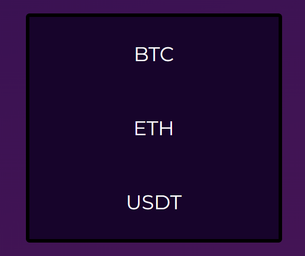
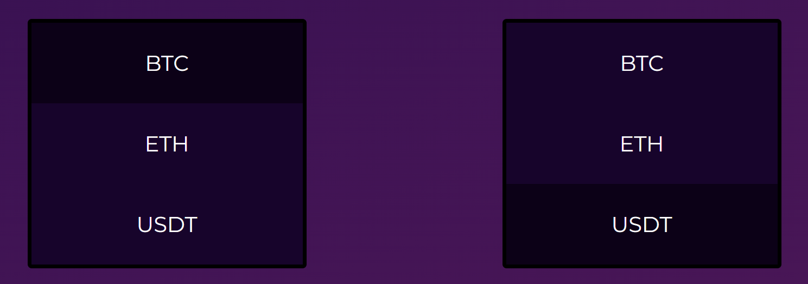

  

<h1 align="center"> EXCHANGE </h1>

This is simple Vue.js project for Crypto currency convertation for desktop version.

 
<h2 align="center"> Features </h2>

You may make exchange or see the rate of 3 Cryptos between themselves

BTC - ETH - USDT

  

 
<h2 align="center"> Configuration </h2>

- You need to select 2 Items to convert, one from left box and the other - right:

BTC - UDST

  

- After input amount and press the button

 
<h2 align="center">  Hope you find it nice </h2>

If you like this project please put the star ⭐

